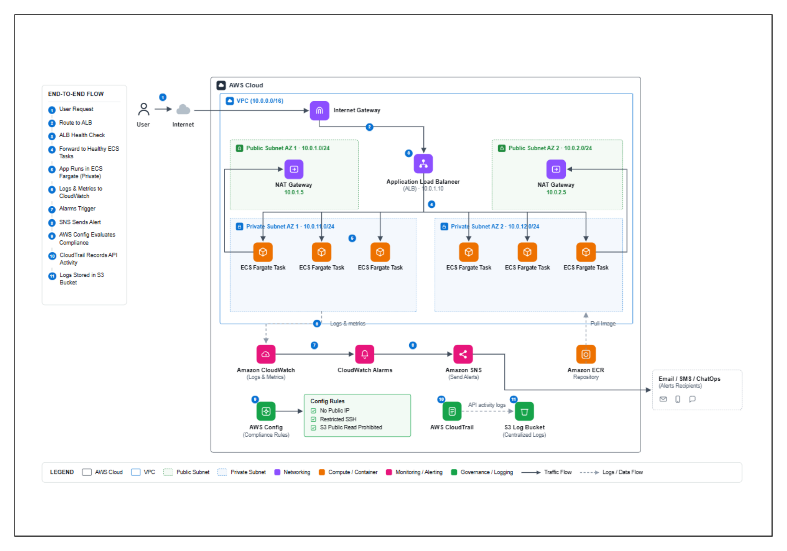

# Intelligent Cloud Infrastructure with Automated Recovery on AWS

I built this project to create an AWS cloud infrastructure that can automatically recover from failures, scale based on workload, monitor the application, and maintain security and audit visibility.

I used AWS services including **Amazon ECS with Fargate, Application Load Balancer, Amazon ECR, VPC, CloudWatch, SNS, AWS Config, CloudTrail, and S3**.

---

## 🚀 About the Project

The main goal of this project was to build infrastructure that requires less manual intervention when failures occur.

The application runs as containers on **Amazon ECS with AWS Fargate**. The containers are deployed in private subnets, while an **Application Load Balancer** handles incoming traffic and routes requests to healthy containers.

The infrastructure also includes automatic scaling, monitoring, alerts, compliance checks, and audit logging.

### Overall Flow

**User → Application Load Balancer → ECS Fargate → Monitoring / Scaling / Recovery**

---

## 🏗️ Architecture



The infrastructure is deployed inside a custom VPC across two Availability Zones.

Main components:

- **Application Load Balancer** – Handles incoming traffic and health checks
- **ECS Fargate** – Runs the application containers
- **Amazon ECR** – Stores the container image
- **Private Subnets** – Hosts the ECS tasks
- **NAT Gateway** – Provides outbound connectivity for private resources
- **CloudWatch** – Provides monitoring, dashboards, and alarms
- **Application Auto Scaling** – Automatically adjusts ECS task count
- **SNS** – Sends alerts and notifications
- **AWS Config** – Monitors selected compliance requirements
- **CloudTrail** – Records AWS API activity
- **S3** – Stores audit logs

Detailed architecture is available in [Architecture Documentation](docs/architecture.md).

---

## ⚙️ What I Implemented

### 🔄 Automatic Recovery

I configured the ECS service to maintain the required number of running tasks.

If a task stops or fails its health check, ECS automatically launches a replacement task. The ALB then starts sending traffic to the new healthy task.

### 📈 Automatic Scaling

I configured ECS service auto scaling using CPU utilization.

- Minimum tasks: **1**
- Desired tasks: **2**
- Maximum tasks: **4**
- CPU target: **50%**

When workload increases, additional tasks are launched. When workload decreases, the service can scale back down.

### 🔐 Private Container Deployment

ECS tasks run inside private subnets with public IP assignment disabled.

The application security group allows HTTP traffic only from the ALB security group, preventing direct public access to the containers.

### 📊 Monitoring

I created a CloudWatch dashboard to monitor:

- CPU utilization
- Memory utilization
- Request count
- Target health
- Response time

### 🚨 Alerts

I configured CloudWatch alarms for:

- Unhealthy targets
- High CPU utilization
- High memory utilization

The alarms send notifications through **Amazon SNS**.

### 🛡️ Compliance & Auditing

I configured AWS Config to monitor selected security-related configurations.

I also enabled CloudTrail to record AWS API activity and configured S3 for centralized log storage.

---

## ☁️ AWS Services Used

| AWS Service | Purpose |
|---|---|
| **Amazon VPC** | Network environment |
| **Application Load Balancer** | Traffic distribution and health checks |
| **Amazon ECS** | Container management |
| **AWS Fargate** | Serverless container execution |
| **Amazon ECR** | Container image storage |
| **Amazon CloudWatch** | Monitoring, dashboards, and alarms |
| **Amazon SNS** | Notifications |
| **AWS Config** | Compliance monitoring |
| **AWS CloudTrail** | AWS API activity logging |
| **Amazon S3** | Log storage |
| **NAT Gateway** | Outbound connectivity |

---

## 🔧 Project Configuration

| Configuration | Value |
|---|---|
| AWS Region | `ap-south-1` (Mumbai) |
| VPC CIDR | `10.0.0.0/16` |
| Availability Zones | 2 |
| Public Subnets | 2 |
| Private Subnets | 2 |
| Container CPU | 0.5 vCPU |
| Container Memory | 1 GB |
| Container Port | 80 |
| Minimum Tasks | 1 |
| Desired Tasks | 2 |
| Maximum Tasks | 4 |
| CPU Scaling Target | 50% |

---

## 📂 Project Structure

```text
intelligent-cloud-infrastructure-aws/
│
├── README.md
├── shiva_final_intelligent_cloud_infrastructure - FINAL.pdf
│
└── docs/
    ├── architecture.md
    ├── deployment-guide.md
    ├── testing-and-cleanup.md
    │
    └── images/
        └── architecture.png
```

## 🛠️ How I Built It

I built the infrastructure using the **AWS Management Console** and AWS-native services.

I started with the VPC and networking, then configured the load balancer, ECS cluster, Fargate service, container image, auto scaling, CloudWatch monitoring, SNS notifications, AWS Config, and CloudTrail.

After completing the setup, I tested the recovery and scaling behavior and documented the results.


## Related Documentation

* [Architecture](architecture.md) — How I designed the infrastructure
* [Deployment Guide](deployment-guide.md) — Steps I followed to build it
* [README](../README.md) — Project overview
* [Full Visual Guide](../shiva_final_intelligent_cloud_infrastructure%20-%20FINAL.pdf) — Complete AWS Console walkthrough

---

## 👨‍💻 Author

**Shiva Matangulu**

I built this project as a hands-on AWS infrastructure project to improve my understanding of **cloud architecture, container deployment, networking, monitoring, security, and automated recovery**.

* GitHub: [@Shiva-Matangulu41](https://github.com/Shiva-Matangulu41)
* LinkedIn: [Shiva Matangulu](https://www.linkedin.com/in/shiva-matangulu)
* Medium: [@shivamatangulu](https://medium.com/@shivamatangulu)
* Dev.to: [Shiva Matangulu](https://dev.to/)

---


